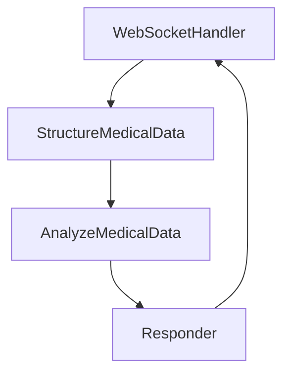

# Design Doc: Medical Transcription System

> Please DON'T remove notes for AI

## Requirements

- Criar um sistema de transcrição médica que receba áudio, transcreva e estruture dados médicos
- Processar transcrições em tempo real via WebSocket
- Identificar elementos médicos como sintomas, diagnósticos, medicamentos, etc.
- Fornecer análise preliminar dos dados médicos identificados
- Integrar com o frontend existente que captura áudio

## Flow Design

> Notes for AI:
>
> 1. Consider the design patterns of agent, map-reduce, rag, and workflow. Apply them if they fit.
> 2. Present a concise, high-level description of the workflow.

### Applicable Design Pattern:

Utilizaremos o padrão **Workflow** para este projeto, pois precisamos processar as transcrições médicas em uma sequência definida de etapas:

1. Receber transcrições via WebSocket
2. Estruturar os dados médicos da transcrição
3. Analisar os dados estruturados
4. Retornar os resultados para o frontend

### Flow high-level Design:

1. **WebSocketHandlerNode**: Gerencia conexões WebSocket e recebe transcrições
2. **StructureMedicalDataNode**: Extrai e estrutura informações médicas do texto
3. **AnalyzeMedicalDataNode**: Analisa os dados estruturados e gera insights
4. **ResponderNode**: Envia respostas estruturadas de volta para o cliente



## Utility Functions

1. **WebSocket Manager** (`utils/websocket_manager.py`)

   - _Input_: Instância WebSocket
   - _Output_: Gerenciamento de conexões
   - Usado pelo WebSocketHandlerNode para gerenciar conexões

2. **Call LLM** (`utils/call_llm.py`)
   - _Input_: prompt (str)
   - _Output_: response (str)
   - Usado para estruturar e analisar dados médicos

## Node Design

### Shared Memory

A estrutura da memória compartilhada é organizada da seguinte forma:

```python
shared = {
    "transcript": {
        "preview": "",  # Transcrição parcial
        "note": "",     # Transcrição completa
        "listening": True,
        "noMatch": False,
        "command": None,
    },
    "websocket": websocket_instance,  # Instância do WebSocket para resposta
    "structured_data": {
        "symptoms": [],
        "diagnoses": [],
        "medications": [],
        "procedures": [],
        "vital_signs": {},
        "notes": ""
    },
    "analysis": "",  # Resultado da análise dos dados
}
```

### Node Steps

1. WebSocketHandlerNode

- _Purpose_: Gerenciar conexões WebSocket e receber dados de transcrição
- _Type_: Regular
- _Steps_:
  - _prep_: N/A (primeiro nó do fluxo)
  - _exec_: Receber dados do WebSocket e parsear JSON
  - _post_: Armazenar dados da transcrição no shared["transcript"]

2. StructureMedicalDataNode

- _Purpose_: Estruturar dados médicos a partir da transcrição
- _Type_: Regular
- _Steps_:
  - _prep_: Ler shared["transcript"]["note"]
  - _exec_: Identificar e estruturar dados médicos (sintomas, diagnósticos, etc.)
  - _post_: Armazenar resultado em shared["structured_data"]

3. AnalyzeMedicalDataNode

- _Purpose_: Analisar dados médicos estruturados
- _Type_: Regular
- _Steps_:
  - _prep_: Ler shared["structured_data"]
  - _exec_: Analisar dados e gerar insights
  - _post_: Armazenar análise em shared["analysis"]

4. ResponderNode

- _Purpose_: Enviar resultados de volta para o cliente
- _Type_: Regular
- _Steps_:
  - _prep_: Ler shared["transcript"], shared["structured_data"] e shared["analysis"]
  - _exec_: Formatar resposta JSON
  - _post_: Enviar resposta para o cliente via shared["websocket"]
